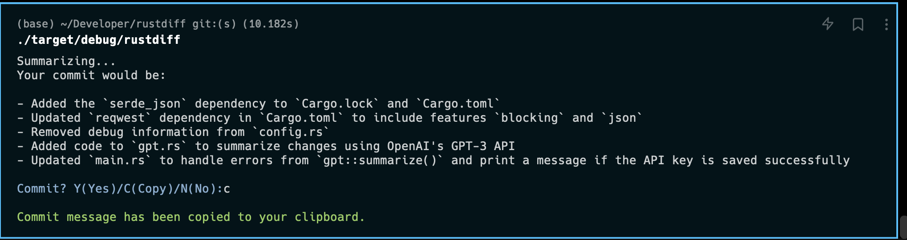

# Introduction

Based on the power of ChatGPT, `rustdiff` summarize your `git diff` outputs into commit message in a bullet way:



# Installation

## Cargo

## Mannual

1. Foward to [release page]() to download executable file.
2. Add executable file to your environment variables.

# Usage

## Set API key

When you first time launch `rustdiff`, you should run

``` rustdiff --set-key=YOUR_API_KEY ```

to set your ChatGPT API key. Your key is only used locally. More information is on [ChatGPT API keys](https://platform.openai.com/account/api-keys).

## Run

Just run `rustdiff` in your git respository, and start summarizing your code changes.

Choose `Y(Yes)` to commit, or `C(Copy)` to copy commmit command, or `N(No)` to exit.

# To do

- Support editing mode.
- Remind token costs before summarizing.